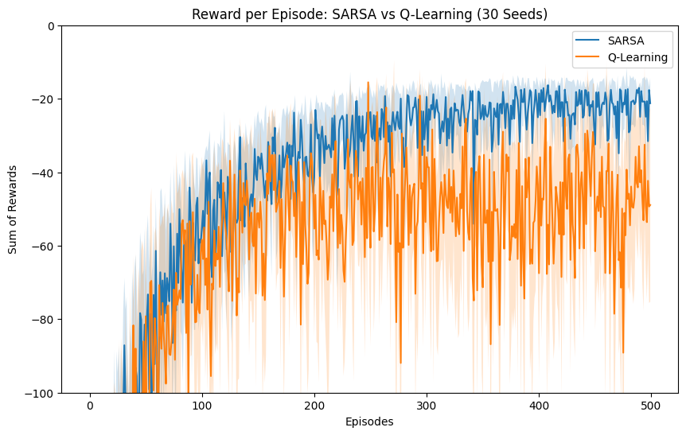

# Lab 4: Temporal Difference Learning (SARSA vs. Q-Learning)
**MSDS 684: Reinforcement Learning | Regis University**

## Project Overview
This project explores the fundamental differences between **On-Policy** and **Off-Policy** reinforcement learning using the `CliffWalking-v0` environment. We implement and compare **SARSA** and **Q-Learning**, focusing on how each algorithm handles the high-risk "cliff" during the exploration-exploitation phase.

## Key Theoretical Concepts
### SARSA (On-Policy)
SARSA updates the state-action value based on the action actually taken by the current policy:
$$Q(S_t, A_t) \leftarrow Q(S_t, A_t) + \alpha [R_{t+1} + \gamma Q(S_{t+1}, A_{t+1}) - Q(S_t, A_t)]$$

### Q-Learning (Off-Policy)
Q-Learning updates based on the maximum possible value of the next state, assuming optimal future play:
$$Q(S_t, A_t) \leftarrow Q(S_t, A_t) + \alpha [R_{t+1} + \gamma \max_a Q(S_{t+1}, a) - Q(S_t, A_t)]$$

## Experimental Results

### Learning Curves (30 Seeds)
The plot below displays the sum of rewards per episode. The shaded area represents the **95% Confidence Interval** calculated over 30 independent random seeds.

### Behavioral Analysis (Heatmaps)
* **SARSA** learns a "Safe" path, keeping the agent one row away from the cliff to account for exploratory mistakes.
* **Q-Learning** learns the "Optimal" path, tracking directly along the edge, which results in higher training penalties but a shorter final route.

| SARSA Value Function | Q-Learning Value Function |
| :---: | :---: |
|  |  |

## Implementation Details
- **Environment:** `CliffWalking-v0` (Gymnasium)
- **Episodes:** 500 per seed
- **Hyperparameters:** $\alpha = 0.1$, $\gamma = 0.99$, $\epsilon = 0.1$
- **Language:** Python 3.x with NumPy, Matplotlib, and Seaborn

## Repository Structure
- `Kakashapati_Barsha_Lab_4.ipynb`: Complete training and visualization logic.
- `Kakshapati_Barsha_Lab_4 Report.pdf`: Formal analysis and AI use reflection.
- `requirements.txt`: Environment dependencies.
- `/*.png`: Exported visualizations for performance analysis.

## References
Sutton, R. S., & Barto, A. G. (2018). *Reinforcement Learning: An Introduction* (2nd ed.). MIT Press.
